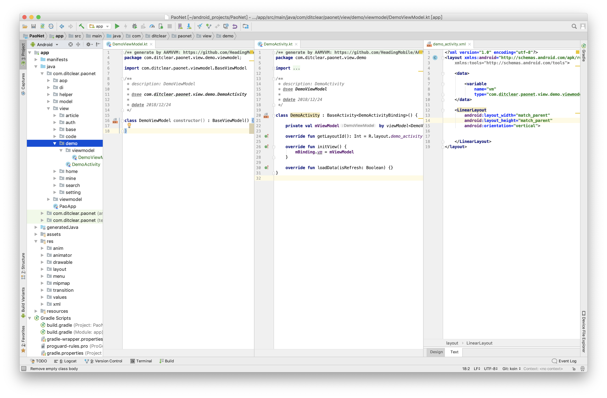

# AAMVVM
快速开发Android MVVM应用程序模板

- MVVM Activity
- MVVM Fragment

### 快速开始

- MAC

打开终端terminal

```bash
cd /Applications/Android\ Studio.app/Contents/plugins/android/lib/templates
git clone https://github.com/HeadingMobile/AAMVVM.git
```

- Windows

打开终端cmd

```bash
cd ${Android studio路径}\plugins\android\lib\templates
// 例：cd C:\Program Files\Android\Android Studio\plugins\android\lib\templates
git clone https://github.com/HeadingMobile/AAMVVM.git
```

然后重启Android Studio。

在对应的目录下右击，选择所需的MVVM模板，提供Java 和 Kotlin版本。

### 示例




gif 示例：https://giphy.com/gifs/jWlRYRVpxNjTHysYBm/fullscreen

### License

[MIT](LICENSE)

