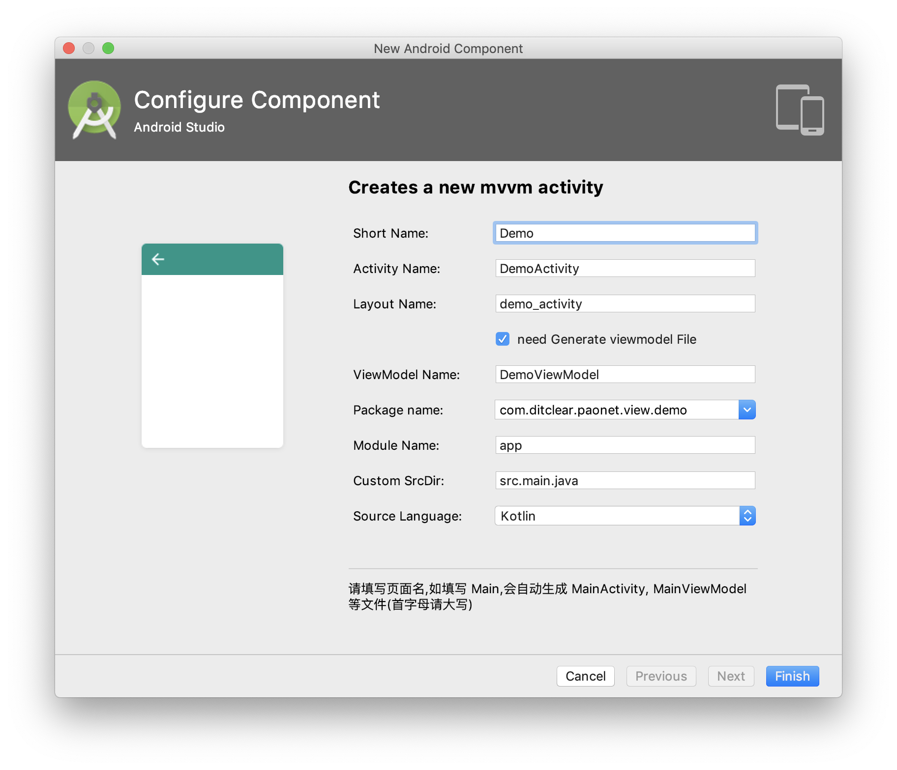

# AAMVVM
快速开发Android MVVM应用程序模板

- MVVM Activity
- MVVM Fragment

专题文章：[《使用Kotin构建MVVM应用程序》](https://www.jianshu.com/c/50336d57e9b0)

小专栏    ：[《使用Kotin构建MVVM应用程序》](https://xiaozhuanlan.com/ditclear?rel=2493325177)

### 示例


gif 示例：https://giphy.com/gifs/jWlRYRVpxNjTHysYBm/fullscreen

### 快速开始

- MAC

打开终端terminal

```bash
cd /Applications/Android\ Studio.app/Contents/plugins/android/lib/templates
git clone https://github.com/HeadingMobile/AAMVVM.git
```

- Windows

打开终端cmd

```bash
cd ${Android studio路径}\plugins\android\lib\templates
// 例：cd C:\Program Files\Android\Android Studio\plugins\android\lib\templates
git clone https://github.com/HeadingMobile/AAMVVM.git
```

然后重启Android Studio。

在对应的目录下右击，选择所需的MVVM模板，提供Java 和 Kotlin版本。

> 注意：依赖注入默认使用Koin，基类请参考[PaoNet](https://github.com/ditclear/PaoNet)示例代码。

### 字段说明



| 字段              | 说明                                                         |
| ----------------- | ------------------------------------------------------------ |
| Short Name        | 页面功能简称                                                 |
| generateViewModel | 是否生成ViewModel，默认生成                                  |
| Package name      | 该页面的packageName                                          |
| Module Name       | 默认为app，如果不是位于app模块，请填写名称                   |
| Custom SrcDir     | 默认为src.main.java，如果不是这个路径，比如在src.main.kotlin，请修改 |
| Source Language   | 支持Kotlin、Java语言，Java语言需要开发者实现获取ViewModel方法 |


### License

[MIT](LICENSE)

